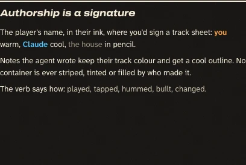
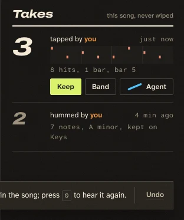
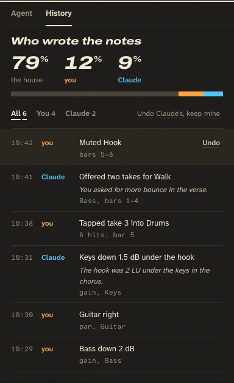
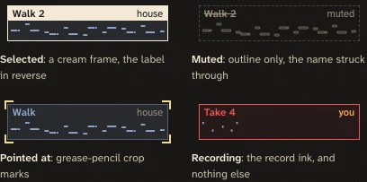
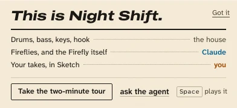
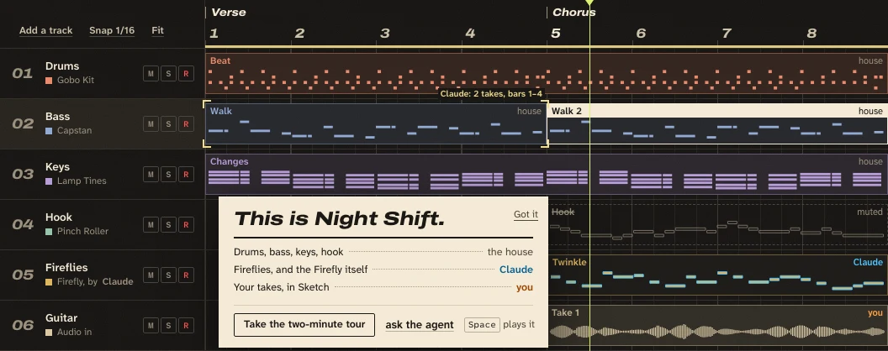
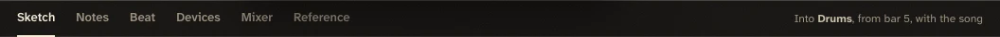
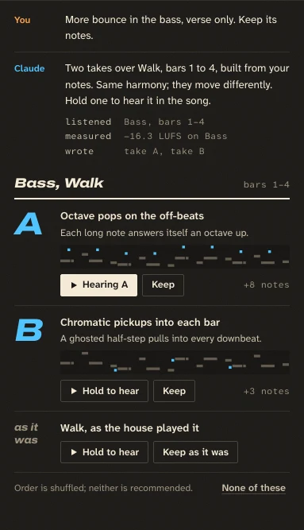
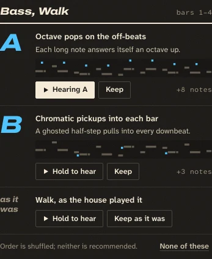
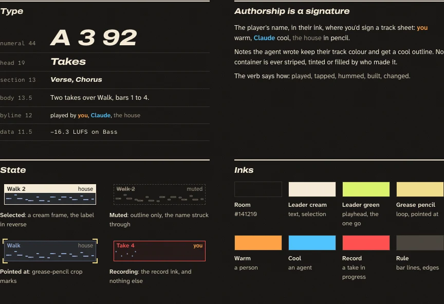

# Liner notes: the kit

The one page a surface follows. The studio is set like the back of a record sleeve: hairline rules and whitespace
instead of boxes, a few display numerals and heads, and every name you read is a signature. The decision and its
amendments are `design/DECISION.md` (the amendments override the mockup); the mockup is
`design/directions/liner-notes/index.html`; the pieces below are cropped from it into `design/kit/`.

Everything here is in `app/style/tokens.css`, `app/style/app.css` and `app/src/ui/dom.js`, so use the class and
don't restyle it in your panel. Your panel's own CSS (layout, columns, canvas drawing) stays in your file.

## The rules

1. **No stripes.** No coloured side, top or corner edge on any box, drawn as a border, an inset shadow or a
   `::before` bar. That includes selection (`inset 2px 0 0`), the current page and the author edge. The track
   colour's 8 px square swatch on a track header is the one DAW idiom kept, and it is a square, not a bar.
2. **Authorship is a byline.** `byline(by, { app })`: the author's name in warm (a person) or cool (an agent) ink, at
   the size of the text it signs, where you'd sign it ("tapped by you", "Firefly, by Claude", the right end of a
   clip's label line). No container is striped, tinted or filled by who made it. Notes keep their track colour and a
   warm or cool outline; cool ink stays off note fills except in the agent's take previews.
3. **The house is unsigned.** `byline('overdub')` returns `null`. Don't write "the house" on demo clips, rows or
   tracks. (The mockup's screenshots still show `house` bylines on clips: the amendments removed them.)
4. **Bylines are for people and agents only.** Not for devices, songs, tools or sections.
5. **No pills, except toggles.** Toggles are square lamps (`.tog`), badges are bylines, filters are underlined words
   (`.btn-txt` or your own underline), tool steps are mono lines, status is a sentence. Nothing has
   `border-radius: 99px` or `50%` (a round record lamp is the exception: it is a lamp).
6. **No glows or pulses.** Only a lit lamp glows (record, the click, a `.tog` that is on). A still cool dot can mean
   "connected"; it never pulses. No hover lift, no fade-up on scroll, no shimmer. Things you do move; the playhead and
   meters follow the audio clock; arrivals are 160 ms on `--ease`; the one bounce (`--ease-wiggle`) is the agent's
   take list arriving. Reduced motion: instant.
7. **Selection is reverse print.** A cream ground (`--text`) with room-coloured text (`--bg`), like a highlighted
   credit (`.sel-print`, `.ledger-row.sel`), plus a 1.5 px cream frame on a canvas clip. Never a stripe, never a wash.
8. **Muted is an outline.** Dashed frame, no fill, hollow pencil notes, the name struck through, and the word
   "muted" where the byline was (`.is-muted`, `.struck`). It stays in the song.
9. **The agent pointing is crop marks.** Grease-pencil (`--accent-2`) marks at the four corners and a one-line label
   ("Claude: 2 takes, bars 1–4"), via `.crop`. Never a glow, a pulse or a flash.
10. **Recording is the record ink and nothing else**: a red frame on the region being written, a red lamp beside
    "Recording take 4". **Playing** is leader green, the playhead only.
11. **At most two heavy heads per screen.** A heavy rule with a display-italic head (`.sheet-head`) opens a region
    ("Takes", "Bass, Walk", "Who wrote the notes"). Every other head is plain text (`.head`). No tracked capitals,
    no eyebrow above a head, no `01 /` numbering on things that aren't a sequence.
12. **No cards, no nesting.** Lists are rows under a rule (`.ledger`). Containers are square. Only things that float
    (the welcome insert, the toast, menus) get a shadow (`--shadow-2`).
13. **Empty states are a sentence and a button** (`.empty`). No icon tile, no illustration, no card.
14. **One primary per region**, in leader green (`.btn-go`): Play in the top bar, Keep in Sketch, Keep on a take.
    Everything secondary is `.btn` or `.btn-txt`.
15. **No sparkle, no face.** `icon('agent')` is a short straight cool stroke (`icon('sparkle')` now draws the same
    stroke until its callers move); `icon('you')` is the same stroke with a breath, in warm. Use the stroke on the
    Agent button and nowhere decorative. No `✦` in copy.
16. **Copy.** Plain claims with a thing or a number, in the engineer's voice. No em-dash cadence, no "not X, it's Y",
    no "X. Y." two-beat heads, no rule-of-three slogans, no bold lead-in sentences, no accented word in a head. Meta
    is a phrase with commas ("8 hits, 1 bar, bar 5"), not `A · B · C`; no decorative `→`. Labels are sentence case
    and sit above their value, like a spec sheet ("Tempo" over `92`).

## Tokens

The contract names keep their meaning; Liner notes changed some values and added names. `tools/brand-test.js`
checks them.

| Token | Value | Use it for |
|---|---|---|
| `--bg` | `#141210` | the room: the arranger and the dock |
| `--bg-2` / `--panel` | `#1a1815` / `#1d1b17` | the second plane: the agent pane and History. The only other ground |
| `--bg-3` | `#24211c` | hover, the selected track's header, the toast |
| `--line` | `#2f2b25` | hairlines, the beat grid |
| `--line-2` | `#46413a` | bar lines, input and button edges, a muted clip's dashed frame |
| `--text` / `--text-2` / `--text-3` | cream / secondary / pencil | `--text-3` is also the house's ink (track numbers, muted notes) |
| `--accent` | leader green | the playhead and the one primary action. Nothing else |
| `--accent-2` | grease pencil | the loop line, lit toggle lamps, crop marks |
| `--human` / `--agent` | warm / cool | **inks**: bylines, the agent's added notes in previews, the share tape. Never fills |
| `--rec` | record red | the take being written, the record button, the All off button's edge |
| `--c-1` … `--c-8` | track inks | clip fill (13% over the room), clip outline (42%), notes, the 8 px swatch. "Which part", never "who". Slate (`--c-5`) is now `#a2a6c6`, a grey-violet, so a slate bass can't read as the agent's |
| `--rule` | `1px solid var(--line)` | the hairline between rows and regions. It separates; it never closes a shape |
| `--rule-2` | `1px solid var(--line-2)` | a bar line, an input's edge, a button's edge |
| `--rule-heavy` | `2px solid var(--text)` | under a region's display head (`.sheet-head`). Twice a screen at most |
| `--r-press` | `2px` | the one radius: buttons, keys, pads, toggles, inputs |
| `--r-1` / `--r-2` / `--r-3` | `2px` / `2px` / `0px` | older names, same rule: things you press are 2 px, containers are square |
| `--shadow-1` | `none` | nothing that sits in the page casts a shadow |
| `--shadow-2` | one soft drop | things that float: the welcome insert, the toast, menus |
| `--paper` | `#f4ead6` | the printed surface: the welcome insert, the provenance print (use `.paper`) |
| `--ink` / `--ink-2` / `--ink-3` | `#16130f` 15.5:1 / `#4c4336` 8.1:1 / `#6e6352` 4.9:1 | type on paper: text / secondary / small print and dot leaders |
| `--ink-human` / `--ink-agent` | `#9a4400` 5.5:1 / `#085f92` 5.7:1 | bylines on paper. The riso pair (`#f07612`, `#1b95dc`) is 2.4:1 and 2.8:1 on cream: mark and overprint only |
| `--paper-rule` | `#cbbfa8` | a hairline or a key's edge on paper |
| `--human-wash` / `--agent-wash` / `--accent-wash` | 14-16% | not for authorship and not for selection. Text selection only, or a held key that is already warm or cool |
| `--ease` / `--ease-wiggle` | curves | arrivals (160 ms) / the agent's take list arriving, once |

## Type

Display is Archivo at `wdth` 125, ExtraBold Italic. UI is Atkinson Hyperlegible Next; data is Atkinson Hyperlegible
Mono. Display is for numerals and a handful of words, never paragraphs or buttons.

| Class | What | Sizes the mockup uses |
|---|---|---|
| `.num` | display italic, tabular figures, line height 1 | position `5.3.1` 30 px; the count-in `1 2 3 4` 46 px; take numbers 44 px; take letters A/B 40 px; History shares 30 px; track numbers `01` 17 px pencil; ruler bars 15 px |
| `.disp` | display italic at `wdth` 125 | sheet heads 19-23 px (40 on a page section); the welcome insert's "This is Night Shift." 23 px; the open Sketch mode 23 px |
| `.disp-s` | display italic at `wdth` 112 | section names on the ruler (Verse, Chorus) 13 px |
| `.mono` | Atkinson Mono 11.5 px, tabular | times, LUFS, bars, tool steps, note counts |
| `.t2` / `.t3` | `--text-2` / `--text-3` | secondary and pencil text |
| (body) | Atkinson Next 13-13.5 px / 1.5 | messages, descriptions |
| (label) | Atkinson Next 600, 12.5-13.5 px | track names, take titles, buttons |
| (small label) | Atkinson Next 400, 10.5-11 px, pencil | "Tempo", "Meter", "Key" above their values. 12 px floor on phones |

## Components

### Bylines: `byline(by, opts)` (`app/src/ui/dom.js`)

```js
import { byline, authorOf } from '../ui/dom.js';
h('span', 'tapped by ', byline('you'))                    // tapped by <span class="by by-human">you</span>
h('header', h('b', clip.name), byline(clip.by, { app }))  // the house returns null and h() skips it
byline('you', { cap: true })                              // "You" (the session log's margin column)
byline(by, { app, name: 'Claude (remote)' })              // your own wording, same ink
authorOf(by, app)                                         // { kind: 'human' | 'agent' | 'house', name }
```

- Renders `span.by.by-human` or `span.by.by-agent` with `data-by`. Weight 600, no background, no border, inherits the
  size of the text it signs (12 px floor on phones).
- `app` lets the store name guests and MCP clients; without it the id is read (`you`, `claude`, `claude.ai`,
  `mcp:<name>`, `guest:<name>-<browser>`).
- Inside `.paper` it switches to `--ink-human` / `--ink-agent` by itself.
- On canvas (clips, notes) draw the same thing: the name in `--human` / `--agent` at the label's size, right-aligned on
  the label line; the byline drops first when the label is crowded; on phones the label shows no byline unless
  selected.
- For a share of authorship, use a strip of tape (the inks laid end to end, pencil for the house), not a pie or a
  dot.



### Buttons

| Class | When |
|---|---|
| `.btn` | any action: a 28 px rule-edged button, 2 px corners, 600 weight, transparent ground |
| `.btn.btn-go` | the one primary action in a region, leader green with room-coloured text |
| `.btn.btn-txt` | a secondary action as an underlined word (Undo, Got it, None of these, Fit, Add a track) |
| `.btn.btn-held` | a button being held ("Hearing A"): cream ground. `.btn:active` does the same |
| `.btn.btn-rec` | a destructive or stop-everything action (All off): the edge in record red |

On phones (`.ew-shell`, under 900 px) `.btn` and `.tog` are 40 px tall and `.btn-txt` gets a 40 px target. The old
`.ew-btn` / `.ew-btn-primary` are the shell's; move them to `.btn` / `.btn-go` as you restyle a surface. Icons inside
a button are fine for transport glyphs and the agent stroke; everything else is a word.

### Toggles: `.tog`

A word with a 6 px square lamp before it (a `::before`, so the markup is just the button). Put `aria-pressed` on it
(`.on` also works). Off: pencil text, a `--line-2` lamp. On: cream text, a grease-pencil lamp that glows a little.
`.tog.tog-rec` lights red. Use it for Click, Loop, Snap, Follow, Count-in, play pads: anything that stays on. Toggles
are the only lit controls.


### Keys: `kbd`

The one bordered inline element: mono 10.5 px, a `--rule-2` edge, 2 px corners, no fill. On paper the edge is
`--paper-rule`. Show the key where the action is ("press `0` to hear it again").

### Sheet head: `.sheet-head`

```html
<header class="sheet-head"><h3>Takes</h3><span class="aside">this song, never wiped</span></header>
```

The title is display italic 19 px sitting on a 2 px cream rule; `.aside` goes right in pencil. **Two per screen at
most** (in the mockup: "Takes" in Sketch and "Bass, Walk" over the agent's takes; History's "Who wrote the notes"
when its pane is open instead). Every other head is `.head` (13.5 px, 600) or a word in `.t3`. Names, not slogans.



### Ledger: `.ledger`

```html
<ol class="ledger" style="--ledger-cols: 40px 56px 1fr auto">
  <li><span class="when">10:42</span><span>{byline}</span><span class="what">Muted Hook<span class="where">bars 5–8</span></span><button class="btn btn-txt">Undo</button></li>
</ol>
```

A track sheet: rows on a grid you set with `--ledger-cols`, one hairline under each, no background per row, no
radius, no card. `.when` / `.where` are mono pencil, `.what` 13 px, `.why` the reason in italic. Use `.ledger-row`
on a row that isn't an `li` (it gets hover `--bg-3` and a focus ring); `.ledger-row.sel` is reverse print. History,
takes, the agent's take list, device lists, the library and the provenance print are all ledgers.



### State marks

| Class | Look | Use |
|---|---|---|
| `.sel-print` | cream ground, room-coloured text, bylines and pencil text go `--bg` | the selected row, the selected clip's label line |
| `.is-muted` | dashed `--line-2` outline, no fill; `.is-muted .name` struck | a muted clip, track or part; write "muted" where the byline was |
| `.struck` | pencil, struck through | a muted name on its own |
| `.crop` | four grease-pencil corner marks over its positioned parent; a `span` inside is the label | what the agent is pointing at. Markup: `h('div.crop', h('i'), h('i'), h('i'), h('i'), h('span', 'Claude: 2 takes, bars 1–4'))` |

Canvas surfaces draw the same marks themselves: selected = a 1.5 px `--text` frame and the label line filled `--text`
with the name in `--bg`; muted = dashed outline, hollow notes in `--text-3`, the name struck; pointed at = four 10 px
L-shaped marks, 2 px, in `--accent-2`.



### Empty: `.empty`

```html
<div class="empty"><p>No notes here yet. Hum or tap a part and it lands on this track.</p><button class="btn">Open Sketch</button></div>
```

A sentence that says what to do, and one button. No icon tile.

### Paper: `.paper`

The printed surface: the welcome insert, the provenance print. Cream ground, ink text, square corners, the one
shadow. Inside it `.t2`/`p` are `--ink-2`, `.t3` is `--ink-3`, bylines use the paper inks, `kbd` and `.btn` take ink
edges, `.sheet-head` takes an ink rule. The insert's credits are a dot-leader list (the part, a dotted `--ink-3`
leader, the byline); the house line is plain `--ink-2`, unsigned.



## Patterns from the mockup

- **Top bar**: lockup, the song title (display upright) with "played by Claude and you" under it, transport glyphs
  (square, triangle in a leader-green button, ring in record red), the position as a big `.num` with the time in mono
  beside it, spec-sheet labels (small pencil label over a value), the click lamps (beat squares, bar 1 wider, the
  current beat cream), All off (`.btn.btn-rec`), the meter and LUFS in mono. Regions are separated by `--rule`
  vertical hairlines, not boxes.
- **Arranger**: a header column (track number `.num` 17 px pencil, the name, an 8 px swatch and the device name with
  "by Claude" when an agent built it, M S R as 19 px 2 px-corner keys), the ruler with section names in `.disp-s`
  and bar numbers in `.num`, clips as track-colour fills at 13% with a 42% outline and a label line. On phones the
  header shows M instead of the number.



- **Dock tabs** are words; the open one is underlined in cream (2 px), not boxed.



- **The agent** is a session log: the speaker's name in a 54 px margin column (`byline('you', { cap: true })`,
  `byline('claude')`), the text in a measure beside it, tool steps as mono lines (`listened  Bass, bars 1–4`), no
  bubbles.



- **The agent's takes**: one list under a sheet head, a big cool letter (A, B) per take in `.num`, the idea, a preview
  roll where the house's notes are pencil and Claude's added notes are cool, Hold to hear / Keep, "as it was" last.



- **The toast**: one line on `--bg-3` with a `--rule-2` edge and `--shadow-2`, what happened, the key, a hairline,
  Undo as `.btn-txt`.


- The whole system on one sheet (type scale, bylines, state, inks):



## Old names, kept working until your surface moves

Tests and `tools/shots.js` select by these, so keep the class on the new element while you restyle, then move to the
new one.

| Old | Now | Move to |
|---|---|---|
| `.badge-agent`, `.badge-human` (pills) | drawn as bylines: ink text, no border, no fill, no radius | `byline(by, { app })` |
| `.by-human`, `.by-agent` on a container (the stripe) | draw nothing on a container; with `.by` they are the byline inks | drop from containers; sign the row with `byline()` |
| `icon('sparkle')` | the cool stroke | `icon('agent')` on the Agent button, or a byline; delete elsewhere |
| `icon('agent')` (the smiley) | the cool stroke | keep for the Agent button only |
| `inset 2-3px 0 0 <colour>` selection or author edges | (yours to delete) | `.sel-print` / `.ledger-row.sel`, or a byline |
| `border-radius: 99px` / `50%` chips | (yours to delete) | `.tog`, `.btn-txt`, a byline, or a mono line |
| `.ew-btn`, `.ew-btn-primary` | unchanged (the shell's) | `.btn`, `.btn-go` |

## Checks

`node tools/brand-test.js` checks the rule in CLAUDE.md and BRAND.md, the tokens (names, corners, shadows, paper inks
at AA on cream, no track colour in the agent's hue), that `app.css` has no stripe and no pill and has every class
above, and in the studio that `byline()` signs people warm and agents cool, leaves the house unsigned, deepens on
paper, and that the old names draw no stripe and no pill. Add your surface's own checks to its test (no
`inset Npx 0 0` in its injected CSS, no `99px`, its bylines present).
