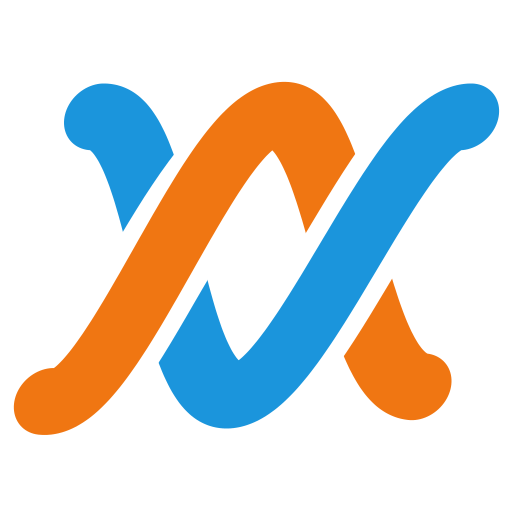

# Overdub brand

How Overdub looks, sounds and talks, in the studio and outside it. The values live in
[`app/style/tokens.css`](../app/style/tokens.css) (names are a contract in [ARCHITECTURE.md](ARCHITECTURE.md); this
document owns the values). The marks live in `app/assets/` and are copied to `site/assets/`; `node tools/brand-marks.js`
regenerates them exactly. The landing page (`site/index.html`) is the brand in one scroll; when in doubt, look at it.
Pictures of the studio on the page are real screenshots, never mockups: `node tools/shots.js` retakes them from
`/app/?demo` into `site/assets/*.webp` (rerun it after a visible UI change), and their captions say what is on screen.
`node tools/brand-test.js` checks the contrast, the marks, the page and the copy.

## The name

**Overdub.** An overdub is a new take laid over an old one: you record the guitar, then play the solo over it. Here
the second player is an agent. You hum, tap, play or say a take; your agent plays over it; you play over that; every
take is signed. The word is the musicians' own, it works as a verb ("overdub it", "Claude overdubbed the keys"), and
it says the song stays yours: an overdub is always on top of something somebody already played.

It also names the job AJ has done for years, as the person in the middle turning other people's ideas into takes.

**The qualifier: Overdub Studio.** "Overdub" is studio jargon, so it is weak to trademark and hard to find in search.
Where we need to be found or registered (the page title, `og:site_name`, app stores, the first mention in press, a
trademark filing), say **Overdub Studio**. Everywhere else, "Overdub" is enough.

Known neighbours, so nobody is surprised: *Overdub: AI Music Generator* (Overdub, Inc.) is an iOS prompt-to-song and
voice-cloning app, in this category, with the opposite pitch; Descript used "Overdub" for years as the name of its
voice-cloning feature; there is also *Overdub EasyMixRecorder*. Domains and marks have not been checked (AJ's call).

**Writing the name.** The wordmark is lower case: "overdub". In prose it is "Overdub" (sentence case), or "Overdub
Studio" as above. Never "OverDub", "Over-dub" or "Over Dub". All capitals only where everything is capitals: the mono
slates and the tape box ("OVERDUB STUDIO · REEL 1").

## Taglines

**Primary: Play over each other.**

It is the product in four words (two players, taking turns on one tape) and it is also how the mark is drawn.

Alternates, each for a different job:

- **Take one is always yours.** The ownership line. The landing page closes on it; use it wherever the worry is "the
  AI makes the song".
- **Two takes, one tape.** For packaging and small spaces: a tape box, a sticker, a favicon tooltip.
- **A studio for you and your agents.** The category line: what it is, in seven words. Under the logo, in app
  stores, in the page title.
- **It doesn't make your song. It helps you make yours.** The positioning line against "type a prompt, get a song".
  It is a promise about scope (notes, parameters and code, not generated audio), so it holds only while that stays
  true; it is AJ's call (see UX-RESEARCH.md, open question 5).
- **Hum it. Tap it. Play it. Say it.** The ways in, as a rhythm. Good on a phone and in a 15-second video where each
  verb gets a beat.
- **Describe a sound. Get a device.** The device-building story.

## Voice and tone

**The engineer behind the glass.** Calm, quick, a little dry. The engineer doesn't perform: they tell you what was
recorded, what changed, and the number, then ask if you want to keep it. They are on your side, they have heard a
thousand takes, and they never make you feel slow.

| Do | Don't |
|---|---|
| "Take 2 is in: Claude doubled your keys an octave up. Keep it?" | "Your AI co-producer enhanced your track!" |
| "Your hum is in. Seven notes, A minor." | "Your audio input has been successfully processed!" |
| "Darker: lowpass from 9.2 kHz to 3.1 kHz on the guitar." | "I've applied some warmth-enhancing adjustments." |
| "The chorus is 3 LU quieter than the verse. Bring it up?" | "Your mix could benefit from improved dynamics." |
| "The mic is blocked. Allow it from the address bar, then press Hum again." | "Oops! Something went wrong 😅" |
| "Cathedral Below: compiles, no NaN, within 1 LU of dry." | "Your revolutionary AI-crafted effect is ready!" |
| "Undo Claude's last change." | "Revert AI modifications." |

Rules of thumb:

- **What was recorded, then what changed, then the number.** The number is the receipt, not the headline.
- **Credit the human.** "Your riff", "your hum", "your chorus". The agent "played over", "doubled", "tidied",
  "suggested", "built". It never "created your song".
- **No buzzwords.** Not "revolutionary", "AI-powered", "unleash", "supercharge", "seamless", "magic",
  "co-producer". If it is good, show it.
- **Never invent proof.** No made-up users, numbers, testimonials or quotes. Use real counts or none: 45 built-in
  devices, 40 agent tools, and from the Guitar Studio 101 pedals, 27 amps, 16 cabinets, 5 mics and 156 rigs.
- **Errors give direction, not mood.** What went wrong, how to fix it. No apologies.
- **Whimsy goes in device names and on the tape box, never on buttons.** A reverb can be called Stairwell and the
  tape box can say "Tails out". The button that stops recording says "Stop".

### Device names

Built-in devices are named after studio objects: things on the desk, in the live room, in the tape machine. A name
is a noun you could point at. Ids are forever (`core.poly`); only the display name carries the brand.

| id | name | | id | name |
|---|---|---|---|---|
| `core.poly` | Patch Bay | | `core.eq` | Top Shelf |
| `core.bass` | Capstan | | `core.comp` | Squeeze Box |
| `core.keys` | Lamp Tines | | `core.verb` | Stairwell |
| `core.pluck` | Pinch Roller | | `core.delay` | Echo Reel |
| `core.drums` | Gobo Kit | | `core.chorus` | Double Track |
| `core.pad` | Room Tone | | `core.filter` | Keyhole |
| | | | `core.drive` | Hot Print |
| | | | `core.crush` | Chewed Tape |
| | | | `core.width` | Gatefold |
| | | | `core.limiter` | Red Line |
| | | | `core.ducker` | Dim Switch |

The Guitar Studio's sea-creature pedals (Krill Swarm, Undertow, Kraken Hall) are heritage and keep their names;
agent-built devices are named by whoever asked for them.

## The mark: the Weave

Two strands cross twice. At the first crossing the warm one (you) is on top; at the second, the cool one (your agent)
is: *play over each other*. Your strand breathes a little, like a played line; the agent's is exact. The two strands
are the brand's only characters.

Construction (`tools/brand-marks.js`, so it is exact and repeatable), in a 100-unit box:

- One wavelength (66 units) of two sine strands about the centre line, amplitude 25, round caps, stroke 12. The cool
  strand is a pure sine; the warm one is its mirror with its swing breathing ±8% over the span.
- Over and under are **masks**, not painted gaps: where a strand passes under, it is cut along the strand on top, 3.4
  units wider on each side. So the gaps are real transparency and the mark sits on any background.
- The whole thing leans 10° (`skewX(-10)`), like the italic wordmark.
- The mark's inks are the riso pair, warm `#f07612` and cool `#1b95dc`: deeper than `--human` and `--agent`, so the
  mark holds on cream paper and on the room. They still mean what warm and cool always mean.

| file | use |
|---|---|
| `logo.svg` | the mark, 512 px nominal; any size from 20 px up |
| `favicon.svg` | the mark without the wobble and with fatter strands, on a rounded `--bg` square; 16-64 px |
| `wordmark.svg` | "overdub" in Archivo Expanded ExtraBold Italic, as outlines, in leader cream, for dark backgrounds |
| `wordmark-ink.svg` | the same in ink `#16130f`, for paper |

The lockup is the mark, then the wordmark, with a gap of about a fifth of the mark's width, wordmark cap height about
half the mark's height (see the landing page's top bar and tape box).

Don't: swap which strand is on top at the first crossing, recolour the strands (warm is always the person), add a
third strand, straighten the wobble, outline it, add a drop shadow, or set it on a busy photo. Clear space: half the
mark's width on every side. The mark can be played (the landing page's hero is the Weave, live); the static mark is
the canonical one.

## Overprint

The signature treatment: a headline printed twice, cool then warm, a hair out of register, like a two-drum riso
print. It says "two takes, one tape" without a word.

- **On the room** (dark): the first copy in `--agent`, the second in `--human` on top with `mix-blend-mode: screen`,
  shifted up and left by about 0.028em by 0.024em. Where they overlap they add up to a light core; the edges show
  each take.
- **On paper** (the tape box, the social card): the riso inks, `--riso-cool #1d9be6` then `--riso-warm #ff7a1a` with
  `mix-blend-mode: multiply`. The overlap prints a deep green; the edges show each ink.
- Markup: `<h2 class="over">TextText</h2>`
  (`site/assets/site.css`). The second copy is hidden from screen readers.
- Headlines only, in the display face, 30 px and up. Never on body text, buttons, numbers or anything in the
  studio's working UI.

## Colour

**The control room at night.** A graphite room with a little warmth in it, leader-tape cream text, and two lamps: a
warm one on the desk (you) and the cool glow of the meter bridge (your agent). Long sessions on a dark, slightly
warm base are easier on the eyes than pure black, and colour reads truer against it.

| token | value | role |
|---|---|---|
| `--bg` | `#141210` | the room |
| `--bg-2` | `#1a1815` | panels |
| `--bg-3` | `#24211c` | raised: hover, open menus, the selected lane |
| `--panel` | `#1d1b17` | the detail and agent panes |
| `--line` / `--line-2` | `#2f2b25` / `#46413a` | hairlines and the beat grid / bar lines and input edges |
| `--text` | `#f4ead6` | leader-tape cream, 15.7:1 on `--bg` |
| `--text-2` | `#cbc0aa` | secondary, 8.9:1 on `--bg-3` |
| `--text-3` | `#9a8f7c` | hints and units, the AA floor: 5.0:1 on `--bg-3` |
| `--accent` | `#d9f36a` | **leader green**: on tape, the leader marks where a take starts. Two jobs only: the playhead and the one primary action. |
| `--accent-2` | `#f1dc8a` | grease pencil: the loop region, the thing the agent is pointing at |
| `--human` | `#ffa043` | **WARM: a person did this** (7.9:1 or better on every surface) |
| `--agent` | `#4cc3ff` | **COOL: an agent did this** (8.0:1 or better on every surface) |
| `--ok` / `--warn` / `--bad` | `#8fdca0` / `#ffd166` / `#ff6b6b` | states |
| `--rec` | `#ff4d4d` | record arm and a take in progress; never decoration |

Every text colour clears WCAG AA (4.5:1) on every surface; text on a leader-green button is `--bg` (15:1).
`tools/brand-test.js` checks all of it.

**Warm and cool are a grammar, not a theme.** Everywhere something has an author, warm means a person and cool means
an agent: the names that sign clips, takes, History lines, chat and devices; the agent's added notes in a take
preview; the History share tape; the cursor; the two strands of the mark. Nothing else may be warm-orange or
cool-cyan in a way that could be read as authorship.

**Authorship is a byline.** The author's name, in warm or cool ink, at the size of the text it signs, where you'd
sign a track sheet: "Walk 2 … Claude" on a clip's label line, "tapped by you" on a take, "Firefly, by Claude" under a
device. A word survives colour blindness and greyscale where a stripe or a dot doesn't. Notes keep their track colour
and a warm or cool outline. **No container is striped, tinted or filled by who made it**: no side stripe, no corner
tab, no wash, no pill badge, and never a dot alone. People and agents sign; **the house is unsigned** (the demo's
parts are the default, so they carry no name). In code it is `byline(by)` in `app/src/ui/dom.js`; the classes and
rules are in `design/LINER-NOTES-KIT.md`. (On the landing page, where nothing has a track colour, warm and cool may
fill the two strands and the overprint.)

**Track colours** (`--c-1` … `--c-8`), eight inks from a well-used studio: rust `#e98a6c`, ochre `#dcb45e`, moss
`#a8c470`, sage `#95c6a8`, slate `#a2a6c6`, heather `#b69cd8`, rose `#e68ba8`, linen `#d9c8a4`. Muted enough to sit
on graphite for hours, each readable as text on `--bg` (7.4:1 or better). Assign in order; the ninth wraps. They say
"which part", never "who". Slate is `#a2a6c6`, a grey-violet (it was `#8fa8d4`, close enough to the agent's cyan that
a slate bass read as the agent's); the brand test keeps every track colour out of the agent's hue.

Washes (extras, not in the contract): `--human-wash`, `--agent-wash`, `--accent-wash` at 14-16%. Never for
authorship; selection is reverse print (cream ground, room-coloured text), not a wash.

**Rules and corners.** `--rule` (a 1 px hairline in `--line`) separates rows and regions and never closes a shape;
`--rule-2` (`--line-2`) is a bar line or an input's edge; `--rule-heavy` (2 px cream) sits under a region's
display-italic title, at most twice a screen. One radius, `--r-press` (2 px), for things you press; containers are
square (`--r-3` is 0). Only things that float (the welcome insert, the toast, menus) cast a shadow (`--shadow-2`);
`--shadow-1` is none.

**Paper** (the landing page's tape box, the social card, and in the studio the welcome insert and the provenance
print; in `tokens.css` and `site/assets/site.css`): `--paper #f4ead6` (the same cream as `--text`, as a surface),
`--ink #16130f` (15.5:1), `--ink-2 #4c4336` (8.1:1), `--ink-3 #6e6352` (4.9:1, small print), and two paper inks for
bylines: `--ink-human #9a4400` (5.5:1) and `--ink-agent #085f92` (5.7:1). The riso pair (`#f07612`, `#1b95dc`) is for
the mark and the overprint only: as 12 px text on cream it is 2.4:1 and 2.8:1. A fine grain sits on both paper and
room, so they feel printed, not rendered.

## Typography

Three faces, all free (the SIL Open Font License), served from the site itself (`app/style/fonts.css`, beside
each family's files and licence in `app/style/fonts/`), so a page asks no font host for anything:

| token | face | why |
|---|---|---|
| `--font-display` | **Archivo**, at its widest (`wdth` 125, set by `--font-display-vars`), ExtraBold (800) Italic | It looks like the logo on a tape box: wide, leaning forward, loud in a confident way. The width carries the whimsy so nothing else has to. Headlines, the song title, device names, big numbers. |
| `--font-ui` | **Atkinson Hyperlegible Next** | Drawn by the Braille Institute so look-alike characters (1 l I, 0 O, rn m) can't be confused. A DAW is a wall of tiny labels read for hours at night; legibility is the feature. |
| `--font-mono` | **Atkinson Hyperlegible Mono** | The same family's mono, for notes text (`C4@0:0.5`), op names, measurements, code and the slates. |

`tokens.css` imports `fonts.css`, which has Archivo with both its italic and roman, its width axis (62-125) and weights
400-900, so the studio can set display text upright where italic would be noisy (the song title in the top bar) and
the web can lean into the italic. On the web, display type is `font-style: italic; font-weight: 800; font-stretch: 125%`; smaller display
text (h3, device names on faces, quoted phrases) steps down to `wdth` 112.

Scale (landing page; the studio uses the small end): the hero line 42-150 px at line height 0.95; section heads 30-58
px; h3 24 px; body 18 px / 1.6; small 15 px; slates 13 px mono capitals, tracked 0.14em. Studio UI: 13 px base, 11 px
minimum, mono 12 px. Display type is for a handful of words: never for paragraphs, never for buttons. Sentence case
everywhere except the slates, the tape box and knob labels on device faces (capitals, ≤ 9 characters, as on real
gear).

## Motion

- **One thing moves on its own: the Weave.** On the landing page a strip of tape runs past a leader-green record head
  at 92 bpm (one bar per wavelength, a crossing on beats 1 and 3) and the two strands are written at the head. Everything
  else moves because you did something.
- **Played versus exact.** The warm strand drifts a little in time, breathes in level and gets vibrato only where a
  note is held; the cool strand is a pure sine. That difference is the whole idea, so keep it visible and keep it
  subtle.
- **Things arrive quickly and settle** (`--ease`: `cubic-bezier(.2, .8, .2, 1)`), 120-250 ms.
- **The one bounce** (`--ease-wiggle`) is reserved for something the agent made appearing: a new clip, a take card,
  a device face. It is the agent saying "here".
- **Audio motion is real.** Meters, playheads and LEDs follow the sound, never a fake animation.
- **Reduced motion** (`prefers-reduced-motion`): nothing loops; the Weave is a still with the whole story in it
  (several crossings, warm on top at the first one you see, both pens labelled); the film gives way to a screenshot;
  state changes are instant. The brand test checks it.
- **Phones first.** One `requestAnimationFrame` loop, paused off screen and in background tabs; canvas at most 2x
  device pixels; the tape is sampled at a fixed rate, not per frame. A frame of the Weave costs well under a
  millisecond, measured at 390 px with the CPU slowed 4x.

## Device faces

Devices draw their own faces from metadata (`look` in the device def), so nobody writes UI to make a pedal and every
agent-built device looks like it belongs. The language comes from Claw'd-o-Matic's pedalboard:

- **Shapes**: `box` (the default stompbox), `wide` (5-6 knobs), `mini` (≤2), `round` (the fuzz-face disc), `wah`
  (a treadle), `rack` (a long unit). **Finishes**: flat, sparkle, brushed, hammer, stripe, check. **Knobs**: black,
  cream, chrome, chicken-head, small. **Labels**: script, block, plate, stencil. **LED**: any colour.
- **Colour** (`color`) and **ink** (`ink`) belong to the device, not the theme: a pedal is an object on the desk, so
  it can be lime green. Make sure ink on colour is readable (4.5:1 for the name).
- **Names in the display face** (italic, `wdth` 112) and the kind beneath in small mono capitals, like a printed
  plate.
- **Knob labels** in capitals, ≤ 9 characters; units shown under the knob in mono; every knob drags vertically, takes
  arrow keys, resets on double-click and is an ARIA slider.
- **Authorship on a face** is a small badge ("by Claude", "by you") in warm or cool, top right. An agent-built device
  defaults to a cool LED until someone gives it another.
- **Names are things you could draw** (Krill Swarm, Cathedral Below, Echo Reel). Descriptions (`blurb`) are plain:
  what it does for you, ≤ 60 characters.
- **No trademarks.** `nod` says what a device tips its hat to in words ("a sixties British top-boost amp"), never a
  brand or model name.

## Illustration

No mascot creature. The two strands are the only characters, and they come alive in motion as they braid.

Illustrations are studio objects drawn as diagrams, in the brand's colours: tape and leader, splices, track sheets,
a tape box with its J-card, a hum woven through quantized notes, arranger lanes, a piano roll, a pedalboard. Draw the
real thing, flat, with real labels, rather than abstract blobs. The recurring pieces on the web:

- **The slate**: a mono, capitalised track-sheet label, on the tape box only ("OVERDUB STUDIO · REEL 1"). Sections
  aren't a sequence, so they aren't numbered; a figure is numbered only because it is a figure.
- **The tape and the splice**: a strip of brown leader tape between the room and the next room, with a cream splice
  tab on it ("Take 2", "Tails out").
- **The tape box**: the landing page ends on paper: the lockup, an overprinted line, the button, the two sides of the
  reel (the 45 built-in devices as a track listing) and the real counts.

No stock photos, no robots, no glowing brains, no sparkle (glyph or icon) to mean "AI", no face on the agent. The
agent's mark is a short straight cool stroke, the Weave's exact strand; a person's is the same stroke with a breath
(`icon('agent')`, `icon('you')`). It goes on the Agent button and nowhere decorative.

## In the studio

- The studio is set like the back of a record sleeve ("Liner notes", `design/DECISION.md`; the kit is
  `design/LINER-NOTES-KIT.md`): a grid of hairline rules and whitespace instead of boxes and cards, display numerals
  and a few display heads, and every name you read is a signature.
- The room is `--bg`; the agent pane and History sit on `--bg-2`; hover uses `--bg-3`. Selection is reverse print
  (a cream ground, the text in the room's colour). Muted is printed in outline: a dashed frame, the name struck
  through, the word "muted". What the agent points at gets grease-pencil crop marks at its corners, never a glow.
- Leader green appears on two things only: the playhead and the one primary action in a region.
- Grease pencil (`--accent-2`) marks the loop and whatever the agent is pointing at.
- Every authored thing is signed with a byline in warm or cool ink (see Colour). The History panel is a track sheet
  of signed lines: the time in the margin, the name in its ink, the change, the reason in italic; the share is a strip
  of tape, the inks laid end to end.
- No pills (toggles are square lamps, badges are bylines, filters are underlined words), no glows or pulses (only a
  lit lamp glows: record, the click), no card inside a card. Empty states are a sentence and a button.
- The top bar shows the mark and the name as the wordmark: lower case, Archivo Expanded ExtraBold Italic
  (`app/style/app.css`).
- The song title is set in the display face (upright, so a long title stays calm); everything else in the UI face;
  numbers in mono, tabular.
- The pitch spiral in the Sketch tab is music theory (one turn per octave), not the logo.
- Agent messages follow the voice: what was recorded, what changed, the number, and a question if it's a matter of
  taste ("Take 2 is in: Claude doubled your keys an octave up. Keep it?").
- Empty states invite an action ("Hum something. Nothing is recorded until you press the button.") and never sell.

## On the web

`site/index.html` (served at `/`):

1. **The hero**: a slate ("Overdub Studio · a studio for you and your agents"), the overprinted line "Play over each
   other.", and the living Weave across the whole width, labelled "you" and "your agent" at the record head, with a
   legend underneath, so it reads with the sound off in two seconds. Then the lede, "Open the studio" and the optional
   **Hum into it**: after a click (and only then) the mic turns on, your voice becomes the warm strand and the cool
   one answers with the same intervals the other way up, in exact semitones. The page says plainly that this answer is
   worked out on the page and that in the studio a real agent plays it.
2. The room: the 30-second demo film and real screenshots.
3. The gap: what musicians say, what DAWs need, and who has been translating.
4. Take one: four ways in, drawn as arranger lanes.
5. The bench: describe a sound, get a device; Cathedral Below, playable and measured (within 1 LU of dry, true peak
   ≤ −1 dBTP).
6. The meters: what an agent sees.
7. The track sheet: every take is signed; undo the agent's change and yours stay.
8. The patch bay: open all the way down (the song document, MCP and its tools, devices as code).
9. Session notes: what went on the reel lately (the demo songs as clips you can open, share links, transforms, the
   device library, provenance and DAWproject, OverdubBench, the browsers), every number counted from the source.
10. Where it came from: the Guitar Studio's pedals on a board.
11. The tape box: "Take one is always yours.", the button, Side A and Side B, and the counts.

The social card is `site/assets/og.png` (1200x630): the tape box over a strip of tape with the Weave on it, rendered
from `site/assets/og-card.html` by `node tools/brand-og.js`. `site/llms.txt` is the page for agents.
