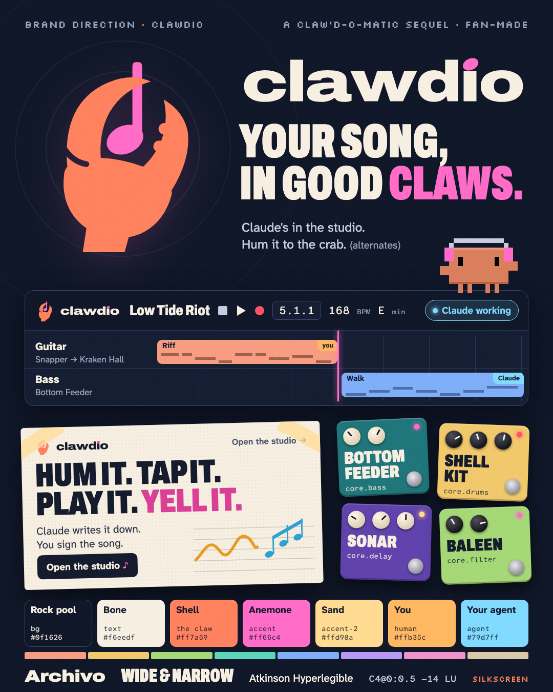

# Clawdio

**Clawd + audio, said "Claudio".** Claw'd-o-Matic's crab frontman gets a studio. The 101 vendored pedals already
live in the sea (Snapper, Kraken Hall), so the product becomes one world. You were the translator between the band
and the machine. Now Claude sits in that chair and you keep the pen. Fan-made and a bit daft.

## Taglines

- **Your song, in good claws.** The promise: it stays yours.
- *Claude's in the studio.* The announcement, and the trademark problem in plain sight.
- *Hum it to the crab.* For phones and short videos.

## Voice

Loud on the poster, exact in the studio. The crab does the hype, Claude does the work, and you get the credit.
Whimsy goes in names, plain verbs go in buttons.
Do: "Sonar's on the guitar: 3/16 echo, 1 LU under dry." Don't: "Clawd just dropped some SICK echo!!"

## Mark

A raised crab claw pinches a note by its stem, held up like a lighter at a gig. Clawd has nubs, not claws, so
the claw is ours even though the mascot isn't. The wordmark is Archivo Expanded Black, with a notehead dotting the i.

## Palette

The rock pool after the gig: navy-ink base `#0f1626`, bone text `#f6eedf`, **shell** `#ff7a59` (the claw only),
**anemone** `#ff66c4` accent, sand `#ffd98a` accent-2. **Warm = a person, cool = an agent**, unchanged. The
tracks are a reef. Text clears AA.

## Type

**Archivo** (Claw'd-o-Matic's own face): Expanded for the name, Condensed for shouting. **Atkinson Hyperlegible
Next / Mono** for UI and data. **Silkscreen** for pixel stamps.

## The 16 house devices

Anemone (poly), Bottom Feeder (bass), Cowrie Keys (keys), Fishing Line (pluck), Shell Kit (drums), Kelp Bed (pad),
Tide Table (eq), Clamp (comp), Sea Cave (verb), Sonar (delay), Shoal (chorus), Baleen (filter), Hot Vent (drive),
Shingle (crush), Manta (width), Seawall (limiter). No clashes with the 101 pedals.

## Mascot

Clawd stays pixel, as Claw'd-o-Matic draws him, and only at the edges: empty states, loading and the landing
page. He never speaks for the agent. The agent speaks as "Claude", in cool.

## Risks

- **The name.** In January 2026 an Anthropic trademark notice made Clawdbot rename (to Moltbot, then OpenClaw).
  "Clawdio" sounds like "Claudio", which is closer still, and Clawd comes from Claude Code's banner. It works as a
  not-affiliated fan project. You can't pitch, register or fund it under this name.
- The claw space is crowded: OpenClaw's lobster ecosystem, and `claw-daw` on PyPI ("a DAW for agents"). I found no
  music product called Clawdio.
- Escape hatch: the mark, palette and device names survive a rename. The name and Clawd don't.
