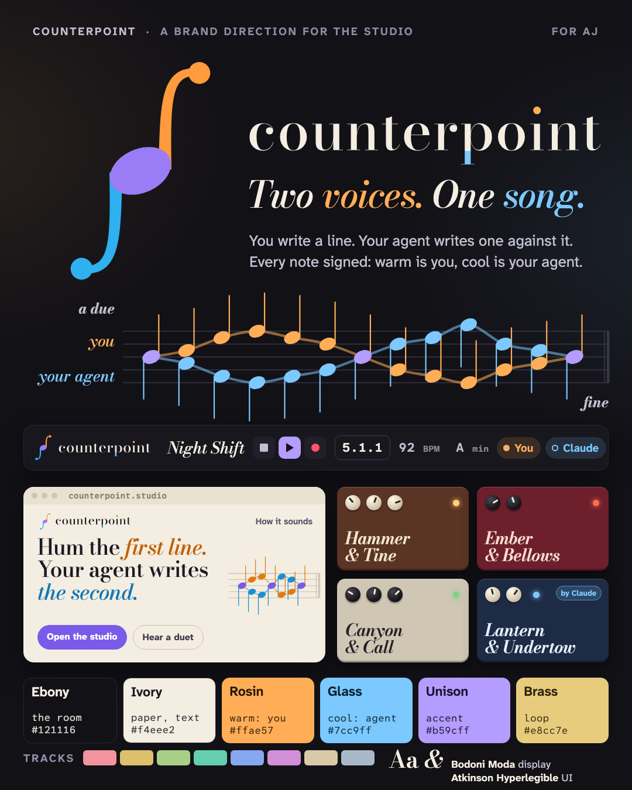

# Counterpoint

**Counterpoint** is two independent lines making one piece. AJ has always been the second voice between a
musician's idea and the DAW; now an agent takes that part. You write a line, it writes one against it, each signed.
It describes the product exactly and sounds like a well-made instrument, not a startup.

**Tagline: Two voices. One song.**
Alternates: *Point against point.* · *Hum the first line. Your agent writes the second.*

## Voice
A chamber musician: listens first, answers in kind, never plays over you.
Exact and unhurried. The number is the receipt, not the headline.
Credits the line to whoever wrote it.
**Do:** "Your line climbs; I held the bass down against it. Undo if it crowds you." **Don't:** "Our AI composed a harmony for you!"

## Mark: the unison
In two-voice notation a shared note is **one notehead with two stems**: up from the right, down from the left.
The stems sweep out into Bodoni balls, so it also reads as a violin's f-hole, and upside down it is the same figure with the voices swapped.
Warm stem (you), cool stem (agent), accent head. In the wordmark the **point** over the i is warm, the p's tail cool.

## Palette
Ebony `#121116` · ivory `#f4eee2` · **rosin `#ffae57` = you** · **glass `#7cc9ff` = agent** · unison `#b59cff`
accent (playhead, selection) · brass `#e8cc7e` loop. Tracks: rose, ochre, sage, jade, cornflower, heather, linen, slate.

## Type
**Bodoni Moda** for display (an engraved score) with **Atkinson Hyperlegible Next/Mono** kept for the UI.

## Devices: every one a duet
Two nouns you could draw. Agents name theirs the same way.

| id | name | id | name |
|---|---|---|---|
| core.poly | Glass & Brass | core.comp | Velvet & Iron |
| core.bass | Anchor & Chain | core.verb | Hall & Hollow |
| core.keys | Hammer & Tine | core.delay | Canyon & Call |
| core.pluck | Quill & String | core.chorus | Twin & Shadow |
| core.drums | Stick & Skin | core.filter | Reed & River |
| core.pad | Moon & Tide | core.drive | Ember & Bellows |
| core.eq | Hill & Valley | core.crush | Mortar & Pestle |
| core.limiter | Cup & Saucer | core.width | Wing & Wing |

## Mascot and illustration
No mascot. The two lines are the characters, drawn as real notation; whimsy lives in score markings (*a due*,
*fine*) and the pedal names.

## Risks
- **Counterpoint Research**, a big tech analyst firm covering AI, owns the search results.
- Namesakes: *Counterpointer* (Ars Nova's notation app; Luisa Pereira's synth), openDAW MCP's `create_counterpoint` tool, a defunct hi-fi amp maker.
- A dictionary word: weak as a sole trademark. Use a compound ("Counterpoint Studio").
