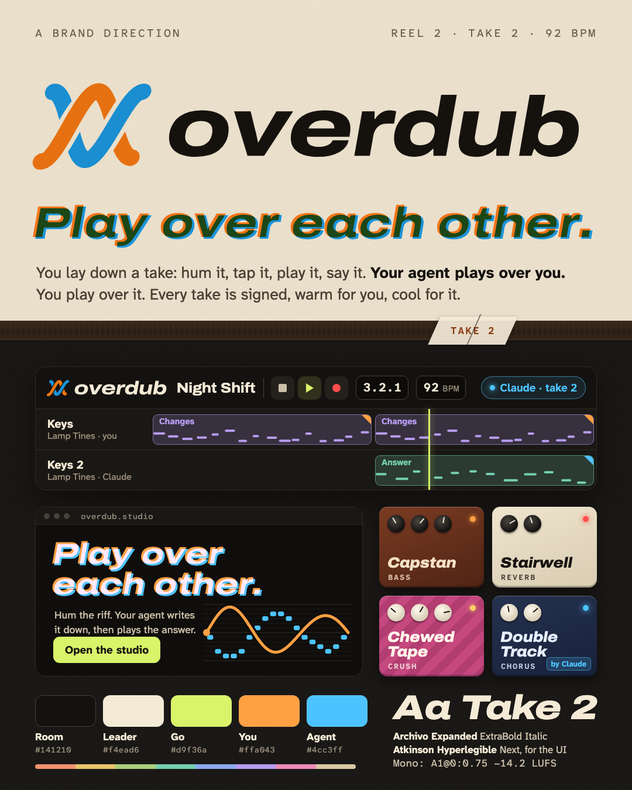

# Overdub

An overdub is a new take laid over an old one. Here the second player is an agent: you hum or play, it plays over you, you play over it, and every take is signed. AJ has spent years as the person turning ideas into takes; Overdub names that back-and-forth in musicians' own words, works as a verb, and says the song stays yours.

**Tagline:** Play over each other.
**Alternates:** Take one is always yours. · Two takes, one tape.

## Voice

The engineer behind the glass: calm, quick, a little dry.
Say what was recorded, then what changed, then the number.
Whimsy goes in device names and on the tape box, never on buttons.
Do: "Take 2 is in: Claude doubled your keys an octave up. Keep it?" Don't: "Your AI co-producer enhanced your track!"

## Mark: the Weave

Two strands cross twice. At the first crossing the warm one (you) is on top; at the second, the cool one (the agent) is: *play over each other*. Your strand wobbles slightly, like a played line; the agent's is exact. Its gaps are masks, so it sits on any background. **Overprint** is the signature treatment: headlines printed twice, warm and cool, slightly out of register, like a riso print.

## Palette (token names unchanged)

The control room at night: graphite `#141210`, leader-tape cream text `#f4ead6`.
Accent **leader green** `#d9f36a` marks where takes start, so it goes on the playhead and the one primary action. Accent-2 is grease pencil `#f1dc8a`.
**Warm `#ffa043` = a person, cool `#4cc3ff` = an agent**, unchanged as a rule. Both are ≥ 7.9:1 on every surface.
Tracks: rust, ochre, moss, sage, slate, heather, rose, linen.

## Type

Display: **Archivo** Expanded ExtraBold Italic, like a tape-box logo. UI: **Atkinson Hyperlegible Next and Mono**, unchanged.

## The 16 devices

Patch Bay (poly) · Capstan (bass) · Lamp Tines (keys) · Pinch Roller (pluck) · Gobo Kit (drums) · Room Tone (pad) · Top Shelf (EQ) · Squeeze Box (comp) · Stairwell (reverb) · Echo Reel (delay) · Double Track (chorus) · Keyhole (filter) · Hot Print (drive) · Chewed Tape (crush) · Gatefold (width) · Red Line (limiter)

## Mascot and illustration

No creature. The two strands are the only characters, and they come alive in motion as they braid. Illustrations are studio objects drawn as diagrams: a hum woven through quantized notes, tape, splices, track sheets.

## Risks

*Overdub: AI Music Generator* (Overdub, Inc.) is an iOS prompt-to-song, voice-cloning app: the same name, in this category, with the opposite pitch. Descript used "Overdub" for years as the name of its voice-cloning feature.
The word is studio jargon (there is also *Overdub EasyMixRecorder*), so it is weak to trademark and hard to find in search. It likely needs a qualifier ("Overdub Studio"). Domains not checked.
