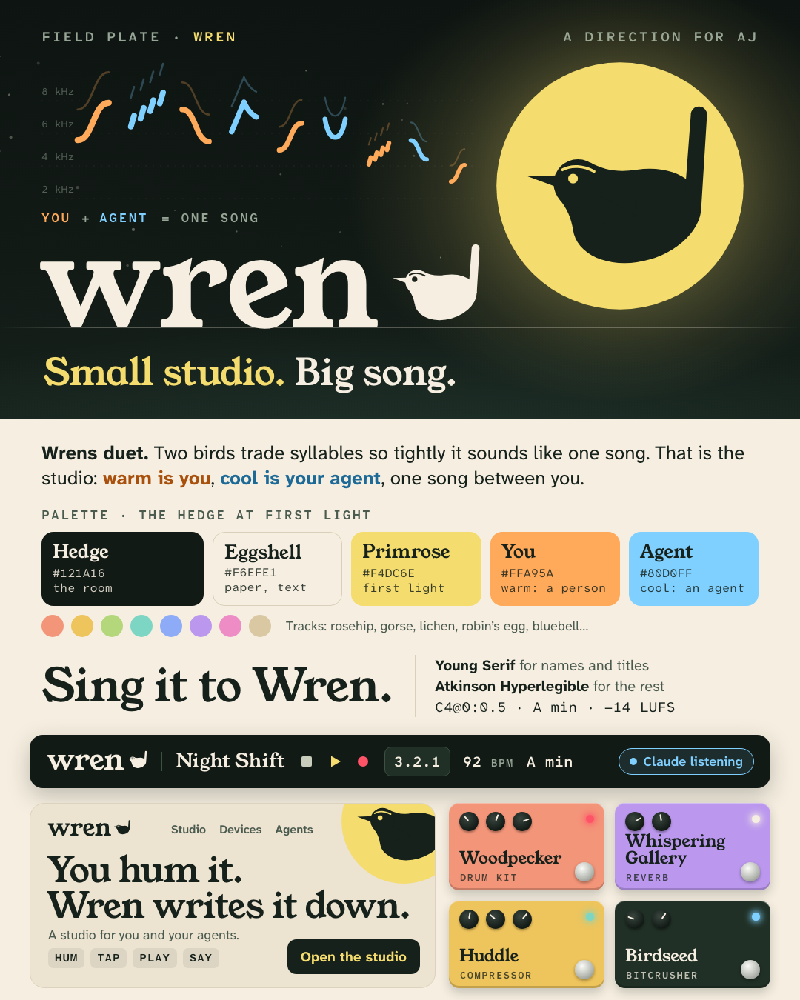

# Wren

**Why Wren.** A tiny bird with an enormous song, like a bedroom musician: small room, big idea. Its Latin name,
*Troglodytes*, means cave-dweller (anyone making music at 2 a.m.). And some wrens **duet**, trading syllables so
tightly it sounds like one bird. That is AJ's story, the translator in the middle, and the product's grammar: you
sing, the agent answers, warm then cool, one song. Charm without grossness, and kin to Murmur and First Light.

## Taglines

**Small studio. Big song.** Alternates: **Sing it to Wren.** (the ways in) and **Two voices. One song.** (authorship)

## Voice

Bright, quick, a morning person. Short lines, like a birdcall: what happened, then the number.
Whimsy in names and pictures, never in instructions.
Do: "Your hum is in. Seven notes, A minor." Don't: "Tweet tweet! Wren heard you!"

## Mark

A wren drawn as a note: the note head is the body, the stem the cocked tail, plus a thin bill, one eye and the pale
eyebrow stripe real wrens have. It sits on a primrose sun (first light; also a whole note), so one file reads on
night and paper. Wordmark: "wren" in Young Serif, the bird perched at the end singing back at its name. Signature
graphic: the **duet sonogram**, warm and cool syllables that grow as they leave the bird, on a faint kHz grid.

## Palette: the hedge at first light

Hedge `#121A16` (room), Eggshell `#F6EFE1` (text, landing paper), **Primrose `#F4DC6E`** (accent), Hawthorn
`#F2A3BC` (loop). **Warm `#FFA95A` = a person, cool `#80D0FF` = an agent**, as before. Tracks: rosehip, gorse,
lichen, robin's egg, bluebell, heather, foxglove, oat. Text colours clear AA on every dark surface.

## Type

**Young Serif** (plump, friendly, field-guide) for display; **Atkinson Hyperlegible Next + Mono** kept for UI.

## Devices

| | | |
|---|---|---|
| poly: **Dawn Chorus** | bass: **Bittern** (it booms) | keys: **Robin's Egg** |
| pluck: **Twig** | drums: **Woodpecker** | pad: **Dewfall** |
| eq: **Preen** | comp: **Huddle** | verb: **Whispering Gallery** |
| delay: **Mockingbird** | chorus: **Flock** | filter: **Thicket** |
| drive: **Ruffle** | crush: **Birdseed** | width: **Wingspan** |
| limiter: **Eaves** | | |

Whispering Gallery is St Paul's, built by the other Wren; wrens huddle by the dozen in one nest box on cold nights.

## Mascot

One silhouette, never a character: no limbs, faces or speech bubbles. It perches on anything that is a line (a twig,
a staff, a waveform, the playhead) and sings only in sonogram marks.

## Risks

Searches found **WrenAI** (Canner), a popular open-source AI data agent, and **Wren Sound Systems**, which holds a
WREN SOUND SYSTEMS trademark for loudspeakers; "Wren" is also a freeware modular synth and a scripting language.
Bare "Wren" is crowded and probably not ownable: plan on a modifier (Wren Studio) and a real clearance search.
