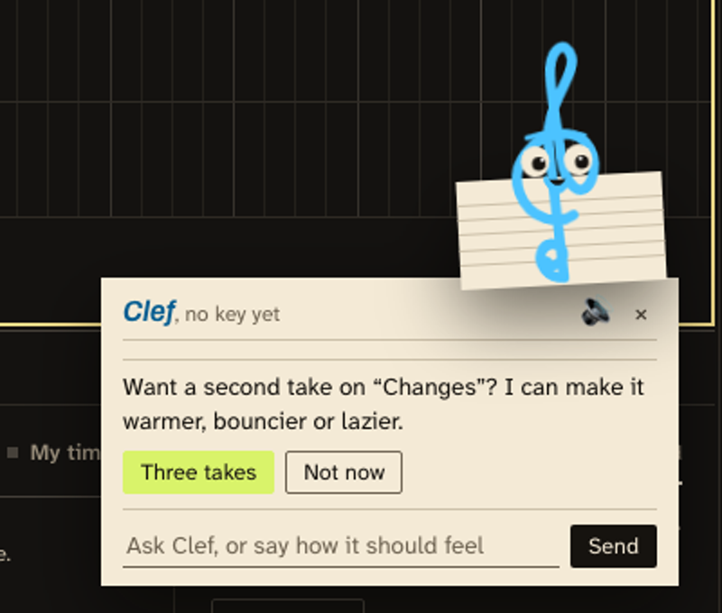
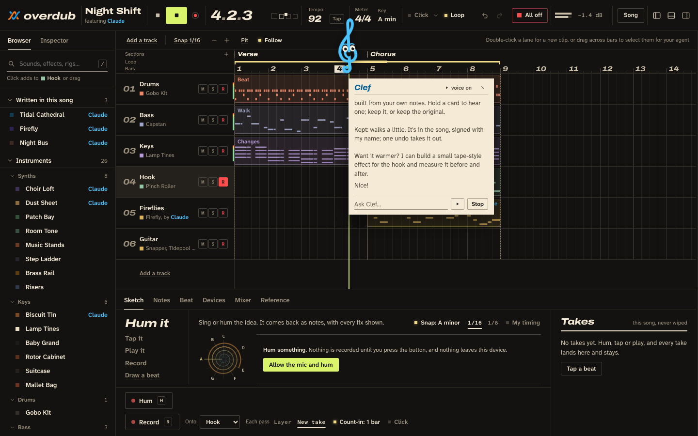
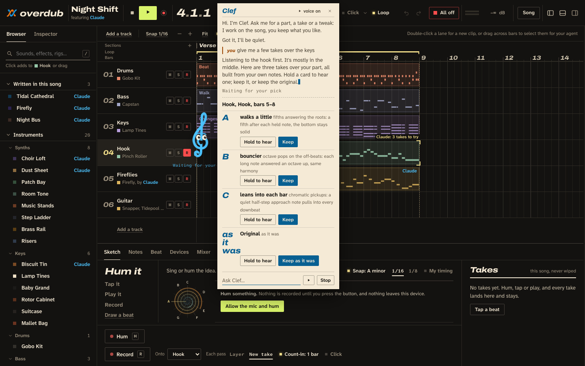
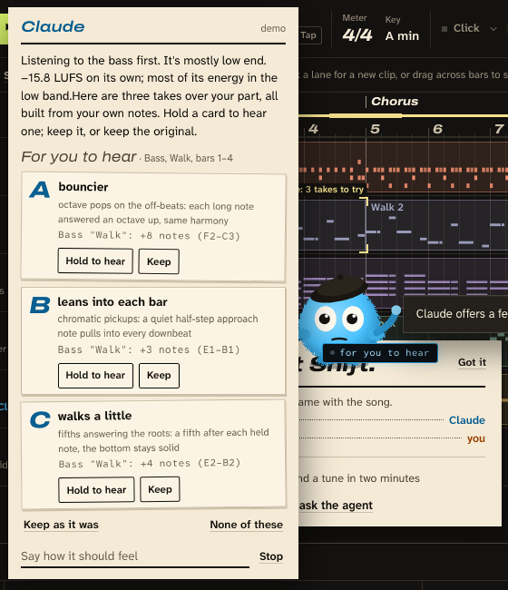
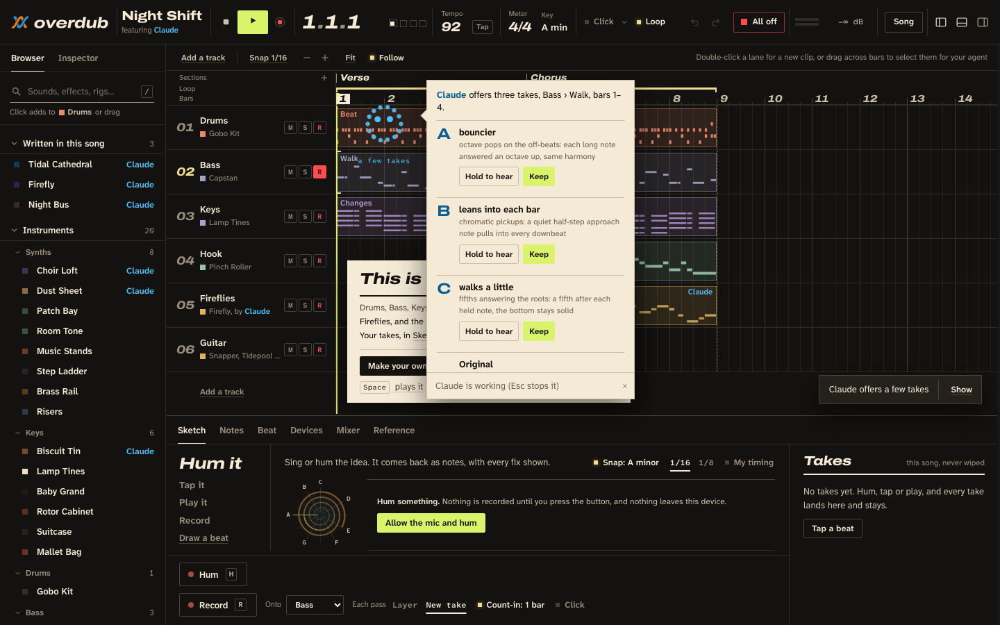
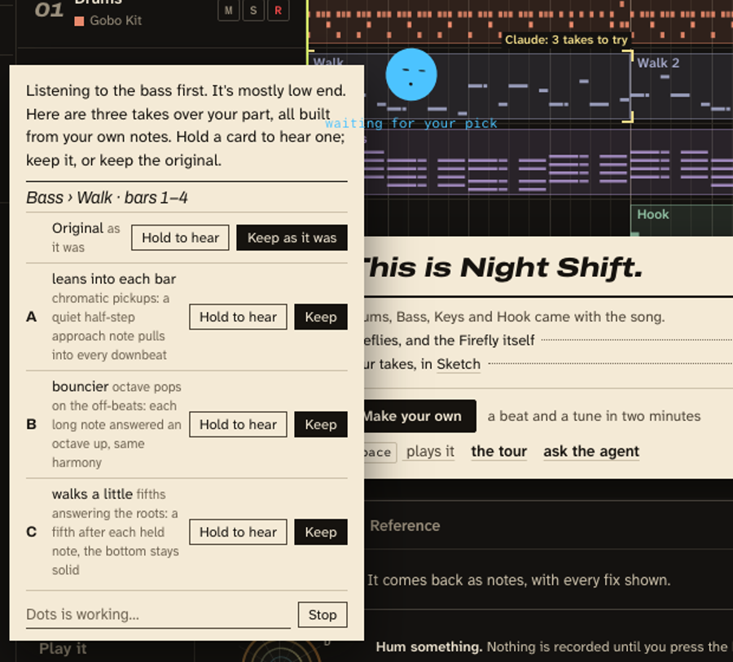
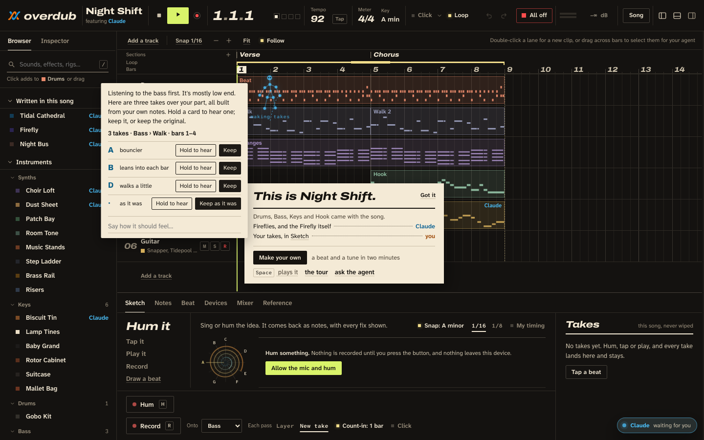

# The agent as a character: six prototypes, archived

On 2026-10-01, in the day run's last half hour, AJ asked for "something like dots. A fun animated character that does
everything. Move the chat from the side to a moving character", then "look up OpenAI dots", then "Honestly we're
talking clippy with a voice and maybe a cute treble clef or something." Six takes were built that evening, one agent
each, each behind a URL flag. On 2026-10-02 he archived them, to save "for a later, more well thought out, day". This
page is where that day starts.

**The references.** OpenAI's Dots (DevDay, 2026-09-29) are agents as always-on coworkers, each with its own computer,
drawn as small fluffy characters in the launch art. Clippy (the Office Assistant, Office 97) is the cautionary one:
Office XP switched it off by default and Office 2007 dropped it, mostly for interrupting.

**What the prototypes are.** Each is one module in `app/src/ui/` plus a one-line hook in `app/src/main.js`. None
changes the song or the agent: they reuse the agent layer the Agent pane uses (`app.agent` for the conversation, ui
`agent:tool` / `agent:request` for steps, takes and questions, `app.tools.audition` / `answer` for the A/B takes,
`app.presence` for what the agent points at), and they hide the pane while they're on. None has tests, none was
reviewed, none was tried on a phone, and nobody has heard the two voices.

## The six

### Corner clef

A treble clef in cool ink on a scrap of manuscript paper, in the arranger's lower right: Clippy for musicians. It
blinks, sways, thinks, dozes and bounces when a take is kept. It reads its replies aloud (the browser's speech
synthesis, never while a take records; a toggle on the bubble), makes one short offer at a time from the song and the
selection ("not now" quiets it for a while), can be dragged, and keeps still under reduced motion. `A` or a click
opens its bubble.

Branch `archive/character-corner-clef` · open `/app/?demo&clef=1&offer=now`



### Conductor clef

The same clef on the timeline. Idle, it sits on the ruler at the start marker; while the song plays it conducts with
its tail in time with the beat; when the agent works on a track it hops onto that track's header; when you keep a
take it bows. It speaks with its mouth in sync and makes offers like the corner clef. Drag it to pin it; double-click
to let it roam again.

Branch `archive/character-conductor-clef` · open `/app/?demo&clef=1&agent=mock`




### Mascot

A small fluffy character on the studio floor, after the Dots launch art. It holds a tiny screen that says what it's
doing (click it for recent steps and History), hops to what it points at, bobs to the beat, holds up an idea or two as
cards after you stop (nothing changes until you Keep one), naps when idle and celebrates a kept take. One per
connected agent: the in-app one wears a beret, an MCP agent headphones.

Branch `archive/character-mascot` · open `/app/?demo&mascot=1&agent=mock`



### Swarm

A loose flock of small cool dots. It forms a face when it talks, orbits while it thinks, spreads into a bar meter when
it measures, streams across the arranger to what the agent points at, pulses on the beat and naps when nobody talks
to it.

Branch `archive/character-swarm` · open `/app/?demo&dots=1`



### Bean

One round cool dot with two eye-dots and a mouth-dot. It talks in a paper bubble with a field under it, hops to what
the agent points at, bounces on the beat and naps.

Branch `archive/character-bean` · open `/app/?demo&dots=1`



### Constellation

Eleven dots joined by thin strands (the Weave mark) as a little figure that walks to what it's working on and points
at it, rearranges into a question mark when it asks, and slumps when it sleeps.

Branch `archive/character-constellation` · open `/app/?demo&dots=1`



## To run one

```sh
git worktree add ../overdub-clef archive/character-corner-clef
cd ../overdub-clef && PORT=3305 node server/serve.js
# open http://localhost:3305/app/?demo&clef=1&offer=now in Chrome, sound on
git worktree remove ../overdub-clef     # from the main checkout, when done
```

Each branch is `main` as of 2026-10-01 evening (`c979d31` under the three dot takes, `1572f54` under the others) plus
one commit. Rebase one onto `main` to build on it.

## Before building it for real

None of these is decided.

1. **The pane or the character.** All six hide the Agent pane. Is the character the agent's only face, or a way to
   show it that you can turn off? The pane still does things a bubble does badly: History, the key setup, the log, a
   long reply.
2. **One character, or one per agent.** The Mascot gives each connected agent its own. The studio already tells
   authors apart by byline ink (warm for a person, cool for an agent).
3. **When it may speak up unasked.** The studio's rule is that the agent offers instead of acting unasked. A character
   makes every offer louder, so: how often, and never while recording or while you play.
4. **The voice.** The clefs use the browser's speech synthesis, which sounds different on every system. A voice worth
   keeping probably means a speech service, with a cost, latency and a key: AJ's call. Then whether it talks over the
   music or ducks it.
5. **Where it lives.** A corner (Corner clef), the timeline (Conductor clef), the floor (Mascot), or beside whatever
   the agent is working on (Swarm, Constellation).
6. **The look.** A cartoon next to the liner-notes look (bylines, no glows, no pills). The clefs stay in cool ink on
   paper; the Mascot is furthest from it. Check against `design/LINER-NOTES-KIT.md` and `docs/research/AI-SMELLS.md`.
7. **Phones, screen readers, reduced motion.** Each prototype checks for reduced motion and marks its bubble as a live
   region, but none was tried with a screen reader, from the keyboard alone, or on a phone.
